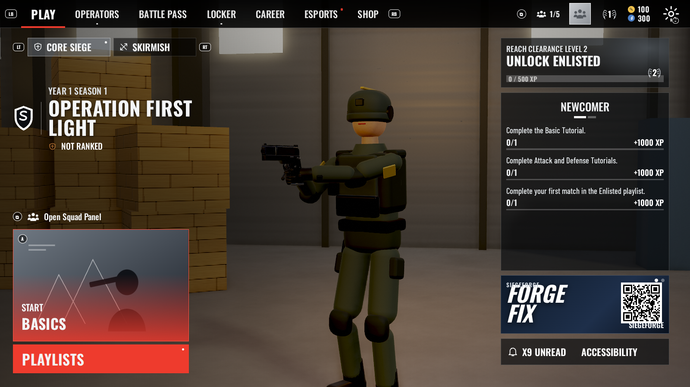

# SiegeForge

A tactical 5v5 siege shooter built on the [ShapeForge Engine](https://github.com/Spaghettiosese/Engine), in the browser, with no build step. Defenders turn the walls of a two-storey depot into steel and barricade the doors; attackers fly drones, open the walls with hammers, thermite and breaching rounds, and plant a defuser. Every operator on both sides is an AI squad member unless you take the slot.



```bash
npm start      # serves the folder on http://localhost:8080 (any static server works)
npm test       # weapon checks, simulation checks, map lint, walk test, AI batch
```

Open `index.html` through a server (ES modules do not load from `file://`), click once, and press **Playlists**. The first tile on the menu is the Basics tutorial.

The 3D shooting range from the engine demo is still here as `range.html` (choose *Shooting Range* in the playlists).

## What you get

- 28 operators, 38 gadgets and 16 weapons; the full list is in [FEATURES.md](FEATURES.md).
- **Harbor Garage**: two floors and a roof, 100 openings, four bomb sites, destructible walls, reinforced steel, hatches, skylights, rappel anchors and bullet penetration.
- Bomb and Secure Area modes, Down But Not Out, round series with side swaps, ranked placements and a hardcore playlist.
- AI that plans as a team: a drone phase, staged pushes, breach roles, post-plant holds, reinforcement and gadget jobs on defence, revives, grenades, cover and callouts, at five difficulty levels.
- The menu suite from the reference screens: main menu, operators, battle pass, locker, career, esports (with a live observer), shop, settings, operator select, HUD, results.
- Three tutorials, daily challenges, a 40-tier battle pass, a shop and ranks, saved in the browser.

## Controls

| Action | Default |
| --- | --- |
| Move · sprint · jump / vault | W A S D · Shift · Space |
| Crouch · prone · lean | C · Z · Q / E |
| Fire · aim | Left mouse · right mouse |
| Reload · melee · inspect | R · V · I |
| Primary · secondary · gadgets | 1 · 2 · 3 / 4 (G uses, B detonates) |
| Interact (hold) | F: doors, plant, disable, reinforce, barricade, revive |
| Drone / cameras · ping | X · T |
| Scoreboard · pause · help | Tab · Esc or P · H |

If the page cannot capture the mouse, push the cursor towards the screen edges to turn, or use the arrow keys. Keys can be rebound in Settings.

## How it is put together

| Folder | What it holds |
| --- | --- |
| `engine/` | The ShapeForge Engine (renderer, scene, characters, animation, physics) |
| `src/weapons/` | The ten authored first-person weapon rigs, shared with the range |
| `src/siege/world/` | The voxel-face world: panels, doors, destruction, ray casting, mesher, map builder |
| `src/siege/data/` | Operators, gadgets, weapons, progression and the Harbor Garage map |
| `src/siege/sim/` | The headless simulation: actors, combat, devices, rounds, navigation |
| `src/siege/ai/` | Perception, movement, bot brains, team directors, gadget behaviour |
| `src/siege/game/` | Rendering of a round: effects, soldiers, viewmodel, audio, player controller, match, tutorials |
| `src/siege/ui/` | The menus, operator select, HUD, 3D menu backdrops and the app shell |

The simulation never touches WebGL, so whole AI rounds run in Node:

```bash
node tools/sim-match.mjs 6 200 2     # one round: seed, seconds, difficulty (0-4)
node tools/sim-batch.mjs 24 2 260    # many rounds, summarised
node tools/walk-test.mjs 300         # bots walk random routes; reports where they get stuck
node tools/map-lint.mjs              # doorway clearance and bomb-spot routes
node tools/nav-map.mjs               # prints the walkable grid of each storey
```

`tools/*-shot.cjs` drive a headless Chromium to take screenshots of the menus and the game.

## Credits

Fonts: Oswald and Barlow Condensed (SIL Open Font License), bundled in `assets/fonts`. SiegeForge is an original game and is not affiliated with any other title.
